  <picture>
    <source media="(max-width: 600px) and (prefers-color-scheme: light)" srcset="./assets/generated/galaxy-header-mobile-light.svg">
    <source media="(max-width: 600px)" srcset="./assets/generated/galaxy-header-mobile.svg">
    <source media="(prefers-color-scheme: light)" srcset="./assets/generated/galaxy-header-light.svg">
    
  </picture>

 

  <picture>
    <source media="(max-width: 600px) and (prefers-color-scheme: light)" srcset="./assets/generated/stats-card-mobile-light.svg">
    <source media="(max-width: 600px)" srcset="./assets/generated/stats-card-mobile.svg">
    <source media="(prefers-color-scheme: light)" srcset="./assets/generated/stats-card-light.svg">
    
  </picture>

 

  <picture>
    <source media="(max-width: 600px) and (prefers-color-scheme: light)" srcset="./assets/generated/tech-stack-mobile-light.svg">
    <source media="(max-width: 600px)" srcset="./assets/generated/tech-stack-mobile.svg">
    <source media="(prefers-color-scheme: light)" srcset="./assets/generated/tech-stack-light.svg">
    
  </picture>

 

  <picture>
    <source media="(max-width: 600px) and (prefers-color-scheme: light)" srcset="./assets/generated/projects-constellation-mobile-light.svg">
    <source media="(max-width: 600px)" srcset="./assets/generated/projects-constellation-mobile.svg">
    <source media="(prefers-color-scheme: light)" srcset="./assets/generated/projects-constellation-light.svg">
    
  </picture>

 

  
  

